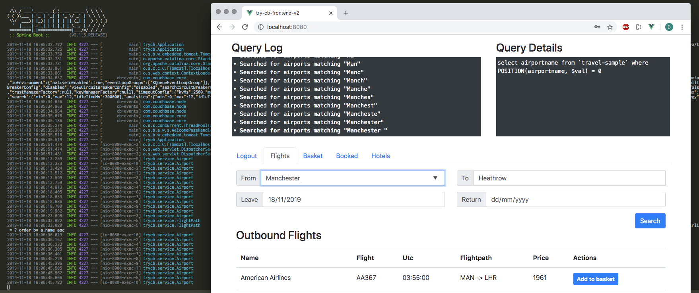

# Couchbase Java Travel-Sample Application
This is a sample application for getting started with Couchbase Server 4.0. The application runs a single page UI for
demonstrating SQL for Documents (N1QL) querying capabilities. It uses Couchbase Server 4.0 (developer preview or later) 
together with Spring Boot, Angular and Bootstrap.

The application is a flight planner that allows the user to search for and select a flight route (including the
return flight) based on airports and dates. Airport selection is done dynamically using an angular autocomplete box
bound to N1QL queries on the server side. Date selection uses date time pickers and then searches for applicable air 
flight routes from a previously populated database.



## Prerequisites
The following pieces need to be in place in order to run the application.

1. Couchbase Server 4.0 DP or later with the `travel-sample` bucket.
2. Java 6 or later
3. Maven 3 or later

If you want to run the application from your IDE rather than from the command line you also need your IDE set up to
work with maven-based projects. We recommend running IntelliJ IDEA, but Eclipse or Netbeans will also work.

## Running the Application
To download the application you can either download [the archive](https://github.com/couchbaselabs/try-cb-java/archive/master.zip) or
clone the repository:

```
$ git clone https://github.com/couchbaselabs/try-cb-java.git
```

Now change into the directory (`$ cd try-cb-java`) and then run the following maven command.

```
mvn spring-boot:run
```

If all goes well, this will start a web server on `127.0.0.1:8080`. 

```
$ mvn spring-boot:run
[INFO] Scanning for projects...
[INFO]                                                                         
[INFO] ------------------------------------------------------------------------
[INFO] Building try-cb-java 1.0-SNAPSHOT
[INFO] ------------------------------------------------------------------------
[INFO] 
...

  .   ____          _            __ _ _
 /\\ / ___'_ __ _ _(_)_ __  __ _ \ \ \ \
( ( )\___ | '_ | '_| | '_ \/ _` | \ \ \ \
 \\/  ___)| |_)| | | | | || (_| |  ) ) ) )
  '  |____| .__|_| |_|_| |_\__, | / / / /
 =========|_|==============|___/=/_/_/_/
 :: Spring Boot ::        (v1.2.3.RELEASE)

2015-04-07 13:28:18.186  INFO 64284 --- [lication.main()] trycb.Application                        : Starting Application on daschlbook.local with PID 64284 (/Users/michael/couchbase/try-cb-java/target/classes started by michael in /Users/michael/couchbase/try-cb-java)
2015-04-07 13:28:18.234  INFO 64284 --- [lication.main()] ationConfigEmbeddedWebApplicationContext : Refreshing org.springframework.boot.context.embedded.AnnotationConfigEmbeddedWebApplicationContext@52f887ba: startup date [Tue Apr 07 13:28:18 CEST 2015]; root of context hierarchy
...
2015-04-07 13:28:20.665  INFO 64284 --- [lication.main()] com.couchbase.client.core.CouchbaseCore  : CouchbaseEnvironment: {sslEnabled=false, sslKeystoreFile='null', sslKeystorePassword='null', queryEnabled=false, queryPort=8093, bootstrapHttpEnabled=true, bootstrapCarrierEnabled=true, bootstrapHttpDirectPort=8091, bootstrapHttpSslPort=18091, bootstrapCarrierDirectPort=11210, bootstrapCarrierSslPort=11207, ioPoolSize=8, computationPoolSize=8, responseBufferSize=16384, requestBufferSize=16384, kvServiceEndpoints=1, viewServiceEndpoints=1, queryServiceEndpoints=1, ioPool=NioEventLoopGroup, coreScheduler=CoreScheduler, eventBus=DefaultEventBus, packageNameAndVersion=couchbase-java-client/2.1.2 (git: 2.1.2), dcpEnabled=false, retryStrategy=BestEffort, maxRequestLifetime=75000, retryDelay=com.couchbase.client.core.time.ExponentialDelay@5ac22970, reconnectDelay=com.couchbase.client.core.time.ExponentialDelay@2003d27d, observeIntervalDelay=com.couchbase.client.core.time.ExponentialDelay@1a9e3545, keepAliveInterval=30000, autoreleaseAfter=2000, bufferPoolingEnabled=true, queryTimeout=75000, viewTimeout=75000, kvTimeout=2500, connectTimeout=5000, disconnectTimeout=25000, dnsSrvEnabled=false}
2015-04-07 13:28:21.043  INFO 64284 --- [      cb-io-1-1] com.couchbase.client.core.node.Node      : Connected to Node localhost
2015-04-07 13:28:21.354  INFO 64284 --- [-computations-5] c.c.c.core.config.ConfigurationProvider  : Opened bucket travel-sample
2015-04-07 13:28:21.559  INFO 64284 --- [lication.main()] s.w.s.m.m.a.RequestMappingHandlerAdapter : Looking for @ControllerAdvice: org.springframework.boot.context.embedded.AnnotationConfigEmbeddedWebApplicationContext@52f887ba: startup date [Tue Apr 07 13:28:18 CEST 2015]; root of context hierarchy
2015-04-07 13:28:21.622  INFO 64284 --- [lication.main()] s.w.s.m.m.a.RequestMappingHandlerMapping : Mapped "{[/api/flightPath/findAll],methods=[],params=[],headers=[],consumes=[],produces=[],custom=[]}" onto public java.util.List<java.util.Map<java.lang.String, java.lang.Object>> trycb.Application.all(java.lang.String,java.lang.String,java.lang.String) throws java.lang.Exception
2015-04-07 13:28:21.623  INFO 64284 --- [lication.main()] s.w.s.m.m.a.RequestMappingHandlerMapping : Mapped "{[/api/airport/findAll],methods=[],params=[],headers=[],consumes=[],produces=[],custom=[]}" onto public java.util.List<java.util.Map<java.lang.String, java.lang.Object>> trycb.Application.airports(java.lang.String)
2015-04-07 13:28:21.624  INFO 64284 --- [lication.main()] s.w.s.m.m.a.RequestMappingHandlerMapping : Mapped "{[/error],methods=[],params=[],headers=[],consumes=[],produces=[],custom=[]}" onto public org.springframework.http.ResponseEntity<java.util.Map<java.lang.String, java.lang.Object>> org.springframework.boot.autoconfigure.web.BasicErrorController.error(javax.servlet.http.HttpServletRequest)
2015-04-07 13:28:21.624  INFO 64284 --- [lication.main()] s.w.s.m.m.a.RequestMappingHandlerMapping : Mapped "{[/error],methods=[],params=[],headers=[],consumes=[],produces=[text/html],custom=[]}" onto public org.springframework.web.servlet.ModelAndView org.springframework.boot.autoconfigure.web.BasicErrorController.errorHtml(javax.servlet.http.HttpServletRequest)
...
2015-04-07 13:28:21.853  INFO 64284 --- [lication.main()] s.b.c.e.t.TomcatEmbeddedServletContainer : Tomcat started on port(s): 8080 (http)
2015-04-07 13:28:21.854  INFO 64284 --- [lication.main()] trycb.Application                        : Started Application in 3.943 seconds (JVM running for 8.494)
```

Note that when you run the application for the first time, it will make sure that all indexes are created for best
performance, so it might take a bit longer. You can follow the output on the command line.

You should then be able to browse the UI, search for US airports and get flight route information. If you are unsure for
what to search for, try from `SFO` to `LAX` and just use the 1st until the 5th of the current month. While doing so, you
can check the command line which prints all the executed N1QL queries:

```
2015-04-07 13:30:20.866  INFO 64284 --- [nio-8080-exec-7] trycb.Database: Executing Query: SELECT airportname FROM `travel-sample` WHERE faa = "SFO"
2015-04-07 13:30:23.219  INFO 64284 --- [nio-8080-exec-8] trycb.Database: Executing Query: SELECT airportname FROM `travel-sample` WHERE faa = "LAX"
2015-04-07 13:30:29.154  INFO 64284 --- [io-8080-exec-10] trycb.Database: Executing Query: SELECT faa AS fromAirport FROM `travel-sample` WHERE airportname = "Los Angeles Intl" UNION SELECT faa AS toAirport FROM `travel-sample` WHERE airportname = "San Francisco Intl"
2015-04-07 13:30:29.154  INFO 64284 --- [nio-8080-exec-9] trycb.Database: Executing Query: SELECT faa AS fromAirport FROM `travel-sample` WHERE airportname = "San Francisco Intl" UNION SELECT faa AS toAirport FROM `travel-sample` WHERE airportname = "Los Angeles Intl"
2015-04-07 13:30:29.222  INFO 64284 --- [io-8080-exec-10] trycb.Database: Executing Query: SELECT a.name, s.flight, s.utc, r.sourceairport, r.destinationairport, r.equipment FROM `travel-sample` r UNNEST r.schedule s JOIN `travel-sample` a ON KEYS r.airlineid WHERE r.sourceairport='LAX' AND r.destinationairport='SFO' AND s.day=5 ORDER BY a.name
2015-04-07 13:30:29.289  INFO 64284 --- [nio-8080-exec-9] trycb.Database: Executing Query: SELECT a.name, s.flight, s.utc, r.sourceairport, r.destinationairport, r.equipment FROM `travel-sample` r UNNEST r.schedule s JOIN `travel-sample` a ON KEYS r.airlineid WHERE r.sourceairport='SFO' AND r.destinationairport='LAX' AND s.day=1 ORDER BY a.name
```

## Custom Options
By default it will connect to the `travel-sample` bucket on `127.0.0.1`. You can conveniently change those options through
the command line on bootstrap:

```
$ mvn spring-boot:run -Dhostname=127.0.0.1 -Dbucket=travel-sample -Dpassword=
```